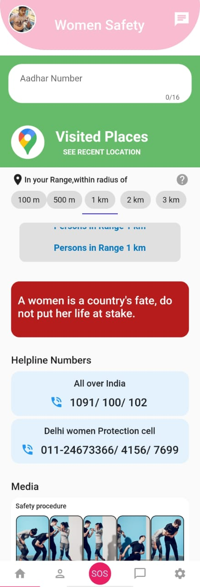
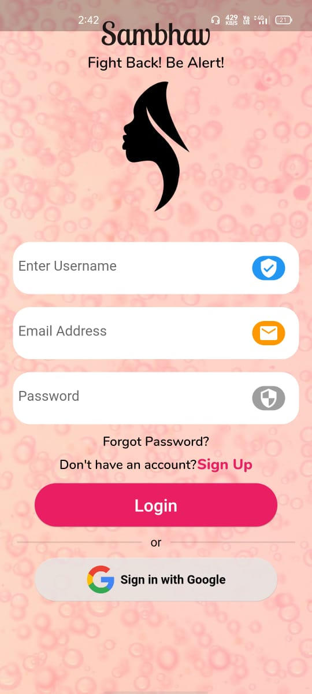
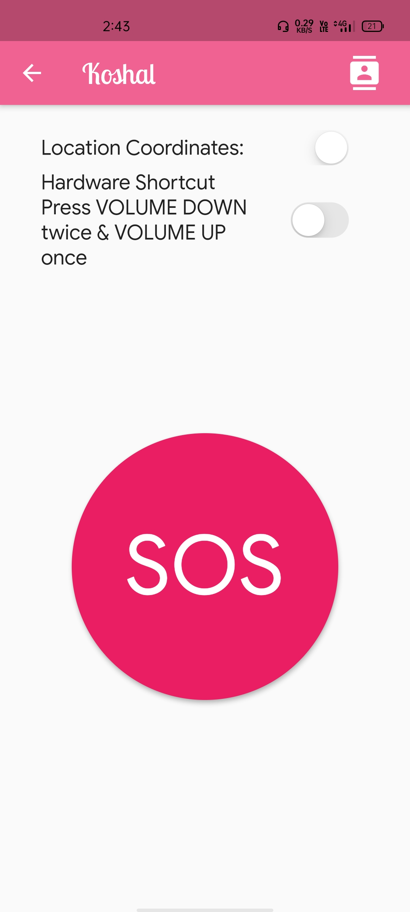

# 
 SAMBHAV
### 
`A women is a country's fate, do not put her life at stake.`

<kbd>

</kbd>
 

### 💭 ABOUT:
An Android App used for Women Safety in which SOS will be sent to emergency contacts and in case of threatening situation user can use voice assistant.
 

### 👩‍💻 TECHNOLOGIES USED:
  * DART
  * FLUTTER
  
  

### 💻 TOOLS USED:
   * Android Studio
   * Adobe XD
   * FIREBASE
   * Github
   
   

  
### Youtube link: [Sambhav](https://youtu.be/-3imKv73nyo)      
   
   
   
### APP SCREENSHOT:
  
  
  
  
 
     
   
